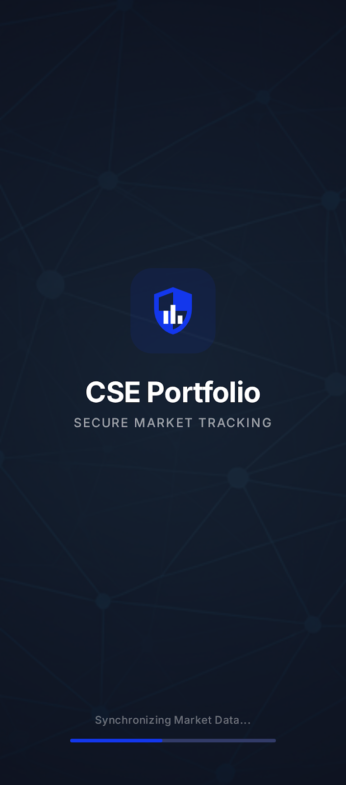
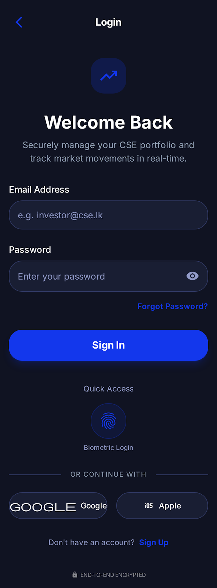
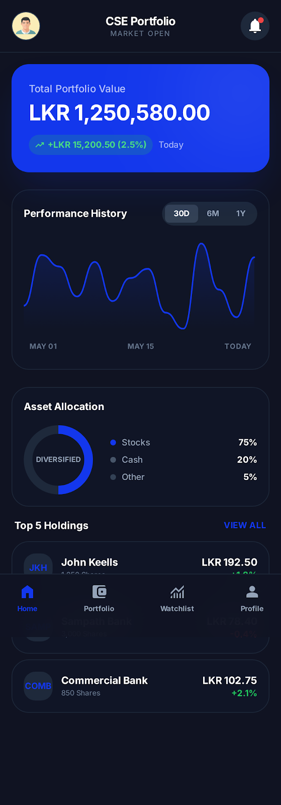
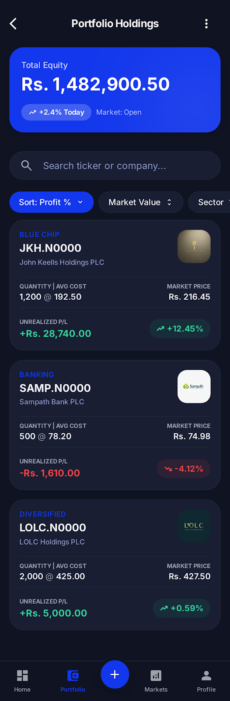
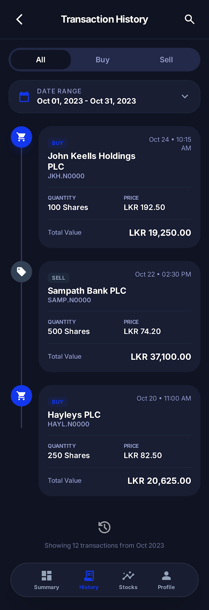
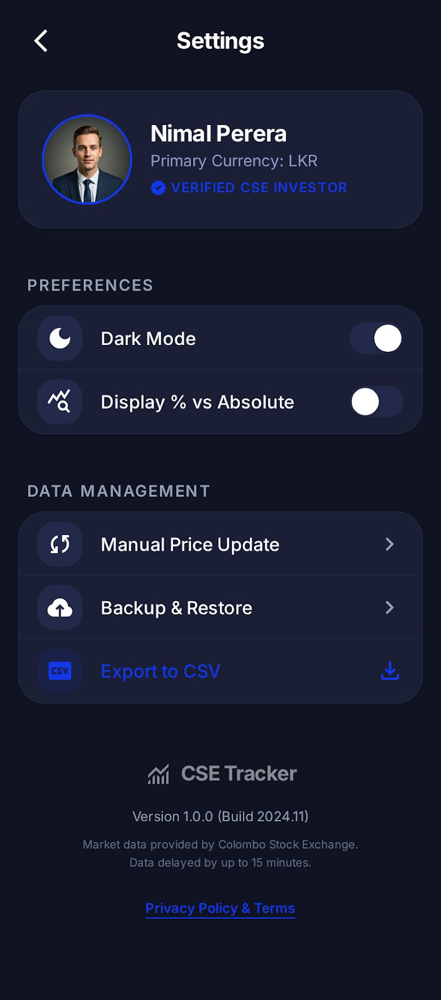

# CSE Portfolio Tracker

A professional-grade mobile application for tracking Colombo Stock Exchange (CSE) portfolios. Built with Flutter, this app features a premium dark-themed UI, real-time market data visualization, and comprehensive portfolio management tools.

## 📱 Screenshots

| Splash Screen | Login | Home Dashboard |
|:---:|:---:|:---:|
|  |  |  |

| Portfolio Holdings | Transaction History | Settings & Profile |
|:---:|:---:|:---:|
|  |  |  |

## 🛠 Tech Stack

- **Framework**: [Flutter](https://flutter.dev)
- **Architecture**: MVVM (Model-View-ViewModel)
- **State Management**: [Provider](https://pub.dev/packages/provider)
- **Dependency Injection**: [GetIt](https://pub.dev/packages/get_it)
- **Routing**: [GoRouter](https://pub.dev/packages/go_router)
- **Charts**: [fl_chart](https://pub.dev/packages/fl_chart)
- **Typography**: [Google Fonts](https://pub.dev/packages/google_fonts) (Inter)

## ✨ Key Features

- **Secure Authentication**: Bio-metric ready login screen with sleek Deep Blue aesthetics.
- **Interactive Dashboard**: Real-time line chart visualization of portfolio performance with asset allocation summary.
- **Portfolio Management**: detailed list of current holdings with live "Unrealized P/L" calculations.
- **Transaction History**: Comprehensive record of all buy and sell activities with filtering capabilities.
- **Customizable UI**: Dedicated Settings & Profile section with dark mode preferences.

## 🚀 Getting Started

1.  **Clone the repository:**
    ```bash
    git clone https://github.com/yourusername/cse_portfolio_tracker.git
    ```

2.  **Install Dependencies:**
    ```bash
    flutter pub get
    ```

3.  **Run the App:**
    ```bash
    flutter run
    ```

## 📂 Project Structure

```
lib/
├── models/          # Data models (Holding, Transaction)
├── screens/         # UI Screens (Home, Portfolio, Login, etc.)
├── viewmodels/      # Business logic and state management
├── locator.dart     # Service locator setup (GetIt)
├── main.dart        # Entry point and app configuration
└── router_config.dart # GoRouter configuration
```
